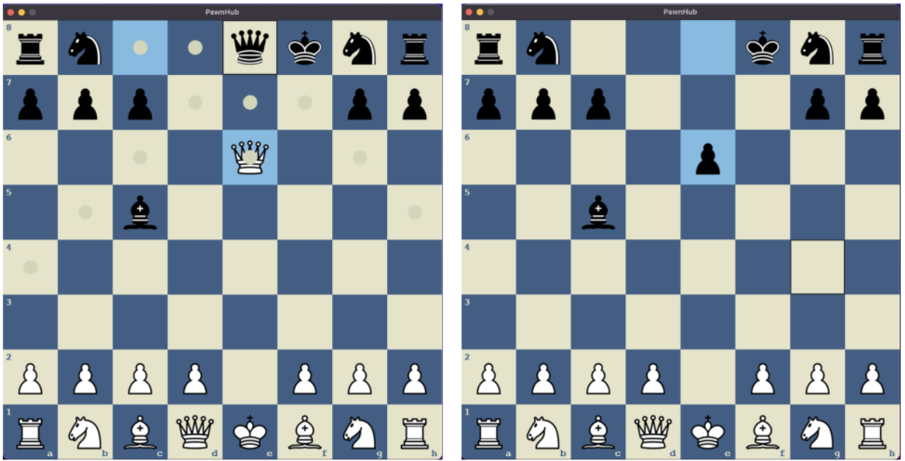

# Pawnhub

Chess is a board game for two players, called White and Black. Each controlling an army of chess pieces in their color, with the objective to checkmate the opponent's king. 

<strong>Pawnhub</strong> is a chess variant. Capturing rival pieces demotes the capturing piece to pawn piece after eleminating captured piece.

### Key mappings

| KEYBOARD - KEY  | KEY MAPPINGS |
| ------------- | ------------- |
| KEY - ESCAPE | Quits the Application|
| KEY -  E | Resets the ongoing Game  |
| KEY - T | Change the theme |

### Pawn promotion mappings
| KEYBOARD - KEY  | KEY MAPPINGS |
| ------------- | ------------- |
| KEY - Q | Promote to Queen after pawn reaches last rank|
| KEY - R  | Promote to Rook after pawn reaches last rank  |
| KEY - B  | Promote to Bishop after pawn reaches last rank  |
| KEY - K  | Promote to Knight after pawn reaches last rank  |

### Low Level design

### Themes in pawnhub

At pawnhub there are four color configuration which can be switched between by pressing Key - T

### Rules in pawnhub

All the traditional chess rules work as it is except captures

- ### Castling 

    

- ### Promotion

    

- ### En passant

    

- ### Capturing

    Capturing works little different at pawnhub, When player plays a move which captures opponents pieces, after eliminating the opponents piece the playes piece demotes in Pawn piece
    
    How is this fair ?

    Capturing pieces with same value is trick here, As higher value pieces gets demoted to pawn pieces player needs to evalute possible captures which doesnt put him at disadvantage. This makes the game more interesting.

  

